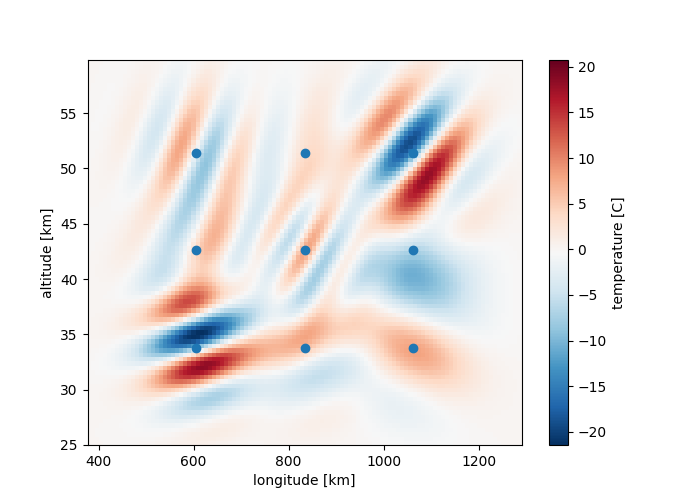

# Gravity wave detection

- Report: [gravity-wave-detection.pdf](../assets/documents/gravity-wave-detection.pdf)

---

An FFT-algorithm to detect gravity waves in atmospheric temperature data. The waves were modelled as [Morlet wavelets](https://en.wikipedia.org/wiki/Morlet_wavelet), whose parameters were found using FFTs and non-convex optimization. The algorithm provides a scalable alternative to [CWT](https://en.wikipedia.org/wiki/Continuous_wavelet_transform). The image above shows reconstructed data with detected wavelets, based on 9 detection points.

The code was written in Python using NumPy, SciPy, JAX libraries.

It was developed as part of a summer project lab in collaboration with [Forschungszentrum Jülich](https://www.fz-juelich.de/de).