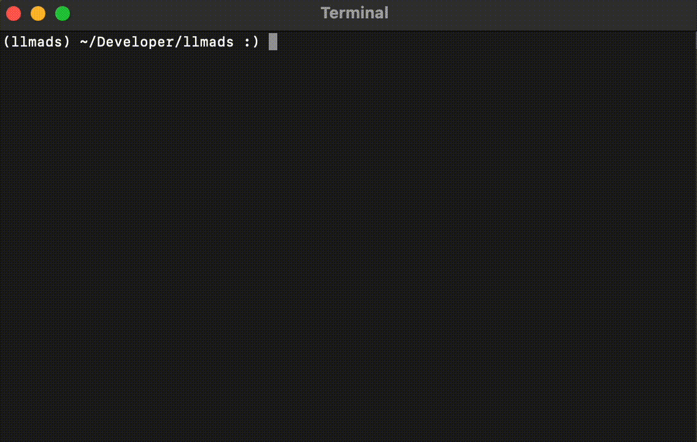

# LLM parser

- Repository: [github.com/ka-sarthak/llmads](https://github.com/ka-sarthak/llmads)

---

A python package that uses large-language-models (LLMs) to parse raw data from files into structured data models. The app goes through the raw file and finds the data corresponding to the data model fields.

The package has been built for the application automated parsing of raw files from simulations and experiments. Taking the example of XRD measurement files, it uses pre-trained [Llama3](https://ai.meta.com/blog/meta-llama-3/) model to read the raw files and populate data models, which are defined using [Pydantic BaseModels](https://docs.pydantic.dev/latest/api/base_model/).

We use chunking of the raw input data and aim towards progressively improving the output from one chunk to the next. This improvement can be in terms of filling in new data as the model comes across it or refining the previously found data.