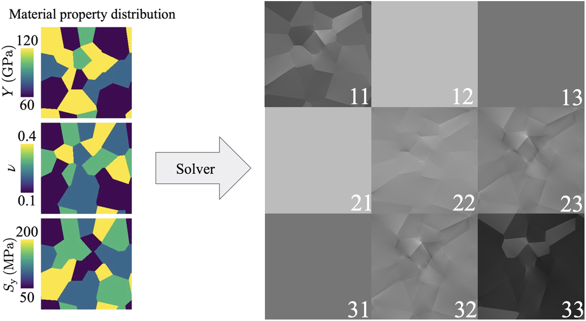

# Micromechanics Generator

- Repository: [github.com/ka-sarthak/mm-Generator](https://github.com/ka-sarthak/mm-Generator)

---

Micromechanics Generator, or mm-Generator, is an implementation of various deep learning (DL) models to generate stress fields in polycrystalline material microstructure. The purpose of the project is to accelerate numerical simulations with the help of trained DL models.

Solid mechanics simulations allow material engineers to craft materials at microstructure level. However, these simulations are based on non-linear physics which becomes enormously expensive to compute (using deterministic fixed-iteration approach) as the system size increases. This paves a way for data-driven learning based approach which offers the promise of speedup by orders of magnitude.

In this package, you will find implementations of GANs, CNNs, and Fourier Neural networks.
