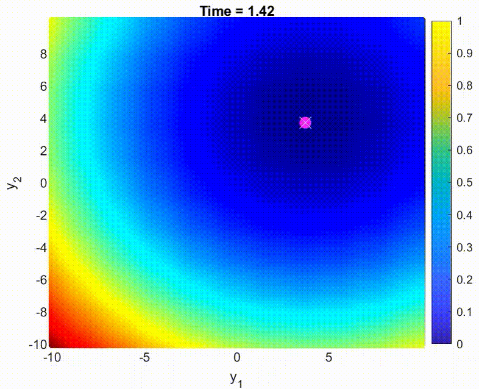

# Tracking optima in dynamic systems

- Report: [tracking-optima-in-dynamic-systems.pdf](../assets/documents/tracking-optima-in-dynamic-systems.pdf)

---

An optima search routine that keeps a track of optima over time in dynamic systems. It allows the global optima to be tracked, rather than having to re-compute expensively at every time step. 

The software was written in C++ using [dco/c++](https://nag.com/automatic-differentiation/) library for automatic differentiation.

It was developed as part of a semester-long lab hosted by [Informatik-12](https://www.stce.rwth-aachen.de) in RWTH.
